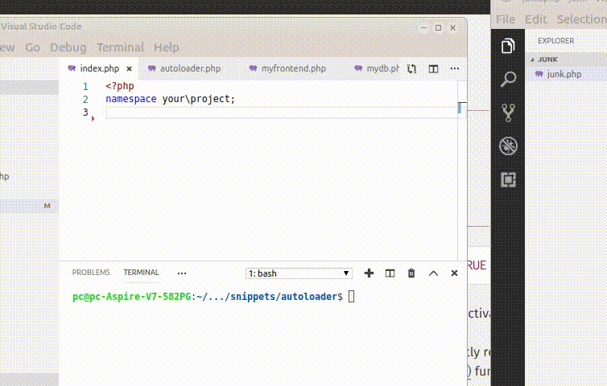

# Simple PHP autoloader

About as simple as it gets and still be useful. Uses [spl_autoload_register
](https://www.php.net/manual/en/function.spl-autoload-register.php)



Note: it assumes the following:

* one class per file
* filename is the same as the classname
* classes are in a folder called 'classes'

* no filename duplication, ie folder1/myclass.php and folder2/myclass.php won't work

## structure

Looks as follows:
```
-------------------------------------------------------------------------------
 Language            Files        Lines         Code     Comments       Blanks
-------------------------------------------------------------------------------
 Markdown                1           33           33            0            0
 PHP                     4           88           51           24           13
-------------------------------------------------------------------------------
 Total                   5          121           84           24           13

├── classes
│   ├── autoloader.php
│   ├── dbstuff
│   │   └── mydb.php
│   └── frontendstuff
│       └── myfrontend.php
├── index.php
└── README.md
```